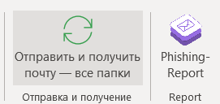
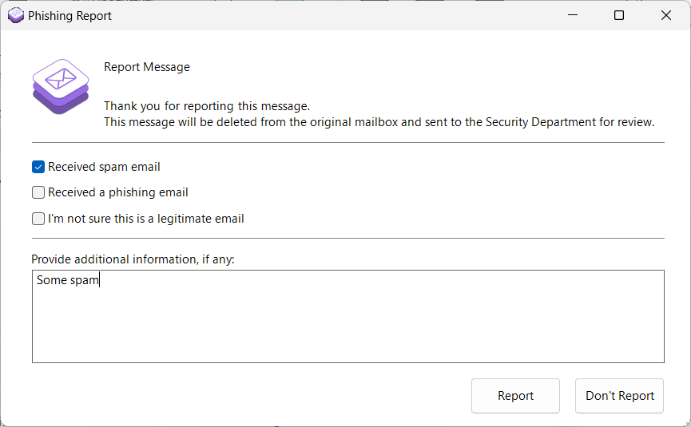

# Плагин Phishing-Report для Outlook

## Обзор
**Phishing-Report** — это плагин для Outlook, позволяющий пользователям быстро сообщать о фишинговых письмах.

### Демонстрация



## Требования к системе
Перед установкой и использованием плагина убедитесь, что ваше окружение соответствует следующим требованиям:

1. **Visual Studio 2022** с дополнением VSTO.
2. **.NET Framework 4.0 и выше**.
3. **Microsoft Office 2013 или новее**.
4. **Installer Project** для Visual Studio.

## Установка и тестирование

### 1. Подписывание проекта сертификатом
Чтобы подписать проект сертификатом:
- Щелкните правой кнопкой мыши на проекте `PhishingReportAddin`.
- Перейдите в `Свойства` -> `Подписывание`.
- Подпишите проект своим сертификатом.

### 2. Настройка параметров
Чтобы настроить параметры плагина:
- Перейдите в `PhishingReportAddin` -> `Свойства` -> `Settings.settings`.
- Установите значение `EmailAddress` на ваш адрес электронной почты для отправки отчетов о фишинговых письмах.

### 3. Компиляция проекта
После настройки параметров:
- Скомпилируйте проект.
- Выходные файлы будут расположены в следующих директориях:
  - DLL, manifest файлы: `\PhishingReportAddin\PhishingReportAddin\bin\Release`
  - MSI установщик: `\PhishingReportAddin\PhishingReportAddinInstaller\PhishingReportAddinInstaller\Release`

### 4. Тихая установка
Чтобы установить плагин в тихом режиме, выполните следующую команду:
```bash
msiexec /i OutlookPhishingAddinInstaller.msi /quiet /qn
```
### 5. Удаление
```bash
msiexec /x OutlookPhishingAddinInstaller.msi
```